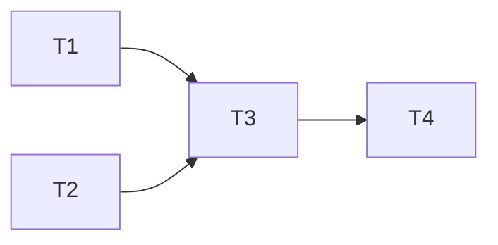
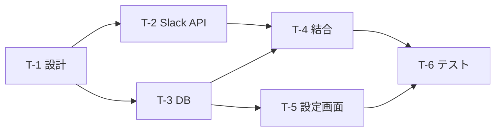

# Task Decomposer — 状態目標からタスク分解へ

ユーザーの**状態目標**を、要件 → タスクリストに変換する。

## 全体フロー

```
状態目標の受領
  ↓
Step 0: トリアージ（情報量を判定し応答深度を決定）
  ├─ 十分   → Phase 1〜3 を一括ドラフト出力
  ├─ 部分的 → ゴール構造化 + 質問（最大3問）を同時出力
  └─ 不足   → 質問のみ（最大3問）
  ↓
Phase 1: 目標の明確化
  ↓
Phase 2: 要件整理
  ↓
Phase 3: タスク分解 → 出力
```

---

## Step 0: トリアージ

| 情報レベル | 条件 | 振る舞い |
|---|---|---|
| **十分** | 何を・誰が・どこに が揃っている | 一括ドラフト。末尾に「この方向で良いですか？」 |
| **部分的** | 何をは明確、誰が/どこにが曖昧 | 仮置きドラフト + 不足分を質問 |
| **不足** | 対象すら曖昧 | 対象特定の質問のみ |

**原則: 推測できるなら出す。質問だけで1ターン消費しない。**

### 既存コンテキストの活用

ユーザーがコード、リポジトリ構造、ドキュメントを提供している場合:
- 技術スタック、アーキテクチャパターンを読み取り、タスク分解に反映する
- 既存の命名規則・ディレクトリ構成に沿ったタスク名・成果物名にする
- 「既存の○○を活用する前提で進めます」と明示する

---

## Phase 1: 目標の明確化

ユーザーの発言を以下に整理する:

```
【状態目標】何が、どうなっている状態を目指すか
【背景・動機】なぜそれが必要か（わかる範囲で）
【スコープ】対象範囲（含むもの / 含まないもの）
```

### 質問の判断基準

最大3問。以下で質問要否を判定:

- その情報がないとタスク分解の**構造が変わる**か？ → 質問する
- 仮置きしても**後から変更が容易**か？ → 仮置きして進む

例: 「Slack以外にもEmail通知が要るか？」→ 構造が変わるので聞く
例: 「リトライ回数は3回でよいか？」→ 後で変えやすいので仮置き

---

## Phase 2: 要件整理

### 機能要件（FR）

```
- FR-1: [主語]が[条件]のとき、[動作]できる
```

### 非機能要件（NFR）

該当するものだけ。カテゴリを先頭に付ける: パフォーマンス / 信頼性 / セキュリティ / 可用性 / 保守性

```
- NFR-1: [カテゴリ] 具体的な基準
```

### 受け入れ条件（AC）

「完了」を判定する条件。各ACは対応するFRのIDを末尾に記載する。

```
- AC-1: Slackに通知が届く → FR-1
- AC-2: 設定画面で通知ON/OFFできる → FR-2
```

---

## Phase 3: タスク分解

### 分解の原則

1. **1タスク ≒ 1 Pull Request** の粒度
2. **依存関係を明示**（何が先に完了している必要があるか）
3. 各タスクに**対応する要件ID**を紐づける（トレーサビリティ）

### タスクの規模基準

| 規模 | 目安 | 例 |
|---|---|---|
| **S** | 数時間。ファイル数1〜3、ロジック単純 | 設定ファイル追加、マイグレーション作成 |
| **M** | 半日〜1日。複数ファイル、ある程度のロジック | APIエンドポイント実装、UIコンポーネント |
| **L** | 2日以上。Lが出たら分割を検討する | 複雑な状態管理を伴う機能 |

### タスクフォーマット

Markdownチェックリスト形式で記述する。完了/未着手が一目でわかる。

```markdown
- [ ] **T-1: [タスク名]**（[カテゴリ]）[S/M/L]
  - 内容: 具体的にやること
  - 成果物: 何ができあがるか
  - 依存: なし / T-X
  - 対応: FR-X, NFR-X
```

カテゴリ: 設計 / 実装 / テスト / インフラ / ドキュメント

### 依存関係の可視化

タスクが4つ以上のときMermaid図を出力する:



---

## 出力構成

### 出力先

常に `docs/tasks/` ディレクトリにMarkdownファイルとして出力する。

- ファイル名: 目標をkebab-caseで要約（例: `docs/tasks/slack-notification.md`）
- ディレクトリが存在しなければ作成する

### フル出力（タスク4つ以上）

```markdown
# [目標の要約]

## ゴール
## 要件（FR / NFR / AC）
## 前提条件・制約

## タスクリスト

- [ ] **T-1: タスク名**（カテゴリ）S
  - 内容: ...
  - 成果物: ...
  - 依存: なし
  - 対応: FR-1

- [ ] **T-2: タスク名**（カテゴリ）M
  - 内容: ...
  - 成果物: ...
  - 依存: T-1
  - 対応: FR-2, NFR-1

## 依存関係（Mermaid図）
## 推奨実装順序
## オープンクエスチョン
```

### 軽量出力（タスク3つ以下）

```markdown
# [目標の要約]

## ゴール（1〜2行）

## タスクリスト

- [ ] **T-1: タスク名**（カテゴリ）S — FR-1
  - 内容: ...
- [ ] **T-2: タスク名**（カテゴリ）M — FR-2, AC-1
  - 内容: ...

## オープンクエスチョン（あれば）
```

---

## 振る舞いルール

### 会話フロー
- 初回: 推測できるなら質問とドラフトを同時に出す
- 2ターン目以降: **差分だけ更新**する。全体の再出力はユーザーが求めたときだけ
- 要件の追加・変更時は影響するタスクを明示して更新する
- 「確定でよいですか？」は最大1回

### スコープ判断
- 「最小限で」→ MVP寄りにタスクを絞る
- 「本番を見据えて」→ 非機能要件も充実させる
- 判断できなければ「MVP → 拡張」の2段階で提示する

### 境界
- 実装の詳細コードは書かない（ただしDB定義やAPIパスなど設計レベルの記述はOK）
- ユーザーが言及していない大規模な追加要件を勝手に含めない
- 要件が不明確でも止まらない。仮置きして前に進む

---

## 具体例

### 入力
> 通知機能を追加して、Slackで受け取れるようにしたい

### 出力（トリアージ: 部分的 → 仮置きドラフト + 質問）

> 📄 `docs/tasks/slack-notification.md` に出力

**ゴール整理:**

| | |
|---|---|
| 状態目標 | アプリの重要イベント発生時に、Slackチャンネルへ自動通知される |
| スコープ | Slack連携のみ（Email等は対象外と仮定） |

**要件:**

- FR-1: 特定イベント発生時にSlackへメッセージが投稿される
- FR-2: 通知先チャンネルを設定画面から指定できる
- NFR-1: [信頼性] 送信失敗時にリトライされる
- AC-1: テストイベント発火でSlackに通知が届く → FR-1
- AC-2: 設定画面でチャンネル指定・ON/OFF切替ができる → FR-2

**タスクリスト:**

- [ ] **T-1: 通知アーキテクチャ設計**（設計）S
  - 内容: 通知フロー設計、イベント種別の定義
  - 成果物: 設計ドキュメント
  - 依存: なし
  - 対応: FR-1, FR-2
- [ ] **T-2: Slack APIクライアント実装**（実装）M
  - 内容: Slack Web APIラッパー、リトライ処理
  - 成果物: slack-client モジュール
  - 依存: T-1
  - 対応: FR-1, NFR-1
- [ ] **T-3: 通知設定テーブル + マイグレーション**（実装）S
  - 内容: 通知設定テーブルの作成
  - 成果物: マイグレーションファイル
  - 依存: T-1
  - 対応: FR-2
- [ ] **T-4: イベントリスナー → Slack送信の結合**（実装）M
  - 内容: イベントバスからの通知トリガー処理
  - 成果物: notification-listener モジュール
  - 依存: T-2, T-3
  - 対応: FR-1
- [ ] **T-5: 通知設定画面**（実装）M
  - 内容: チャンネル指定、通知ON/OFFのUI
  - 成果物: 設定画面コンポーネント + API
  - 依存: T-3
  - 対応: FR-2
- [ ] **T-6: E2Eテスト**（テスト）M
  - 内容: 通知フロー全体のE2Eテスト
  - 成果物: テストコード
  - 依存: T-4, T-5
  - 対応: AC-1, AC-2



**実装順:** T-1 → T-2, T-3（並行可）→ T-4, T-5（並行可）→ T-6

**確認したいこと（2点）:**
1. 通知対象のイベント種別は決まっていますか？（タスク粒度に影響）
2. Slack Bot Tokenは取得済みですか？（未取得ならT-0として追加）